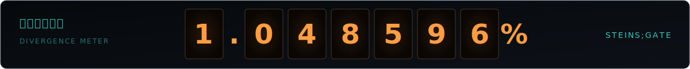

<picture>
  <source media="(prefers-reduced-motion: reduce)" srcset="./assets/worldline-banner-static.png">
  
</picture>

 

  

  

  

<picture>
  <source media="(prefers-color-scheme: dark)" srcset="https://raw.githubusercontent.com/hufaei/hufaei/output/github-contribution-grid-snake-dark.svg">
  <source media="(prefers-color-scheme: light)" srcset="https://raw.githubusercontent.com/hufaei/hufaei/output/github-contribution-grid-snake.svg">
  
</picture>

次ノ世界線ヘ // TO THE NEXT WORLD LINE

