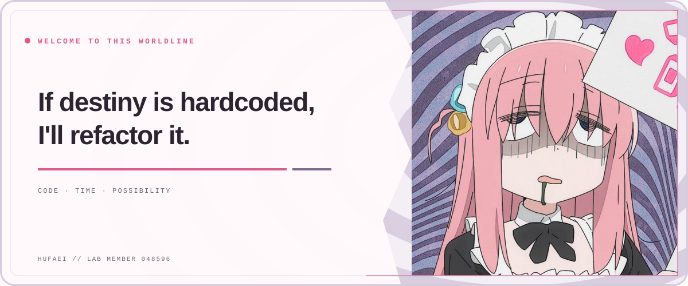
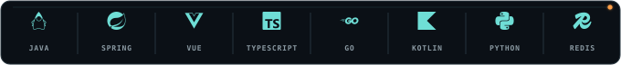

<picture>
  <source media="(prefers-color-scheme: dark)" srcset="./assets/worldline-banner.svg">
  <source media="(prefers-color-scheme: light)" srcset="./assets/worldline-banner-light.svg">
  
</picture>

 

&emsp;&emsp;&emsp;&emsp;

 

<picture>
  <source media="(prefers-color-scheme: dark)" srcset="https://raw.githubusercontent.com/hufaei/hufaei/output/worldline-stats.svg">
  <source media="(prefers-color-scheme: light)" srcset="https://raw.githubusercontent.com/hufaei/hufaei/output/worldline-stats-light.svg">
  
</picture>

 

<picture>
  <source media="(prefers-color-scheme: dark)" srcset="./assets/worldline-sequence.svg">
  <source media="(prefers-color-scheme: light)" srcset="./assets/worldline-sequence-light.svg">
  
</picture>

 

<a href="https://anilist.co/user/LJTLI/">
  <picture>
    <source media="(prefers-color-scheme: dark)" srcset="https://raw.githubusercontent.com/hufaei/hufaei/output/anilist-favorites.svg">
    <source media="(prefers-color-scheme: light)" srcset="https://raw.githubusercontent.com/hufaei/hufaei/output/anilist-favorites-light.svg">
    
  </picture>
</a>

 

<picture>
  <source media="(prefers-color-scheme: dark)" srcset="https://raw.githubusercontent.com/hufaei/hufaei/output/github-contribution-grid-snake-dark.svg">
  <source media="(prefers-color-scheme: light)" srcset="https://raw.githubusercontent.com/hufaei/hufaei/output/github-contribution-grid-snake.svg">
  
</picture>

次ノ世界線ヘ · TO THE NEXT WORLD LINE

